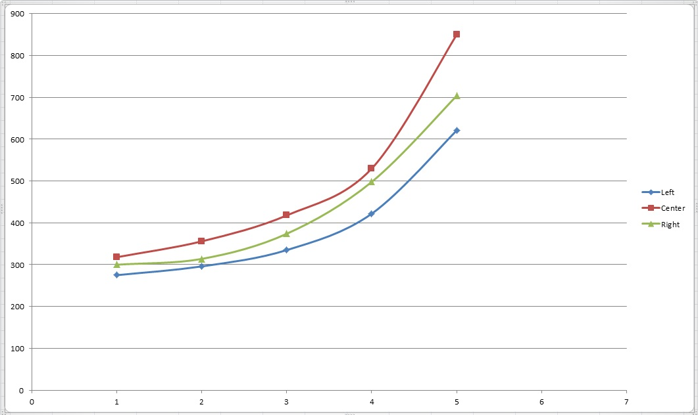

ECE382_Lab7
===========

Robot sensing with the ADC10 subsystem

## Objectives and Purpose

To use ADC10 with infrared sensors to sense distance for the robot maze challenge.

## Functions 

### initMSP430

```
void initMSP430() {

	IFG1=0; 					// clear interrupt flag1
	WDTCTL=WDTPW+WDTHOLD; 		// stop WD

	BCSCTL1 = CALBC1_8MHZ;
	DCOCTL = CALDCO_8MHZ;

	TA0CCR0 = 0x0BA2;							// create a 1mS roll-over period
	TACTL &= ~TAIFG;							// clear flag before enabling interrupts = good practice
	TACTL = ID_3 | TASSEL_2 | MC_1 | TAIE;		// Use 1:8 presclar off MCLK and enable interrupts

	// ADC Subsystem Setup
	ADC10CTL0 = 0;									// Turn off ADC subsystem
	ADC10CTL1 = ADC10DIV_3;						// Channel 4, ADC10CLK/4
	ADC10AE0 = BIT4 | BIT3 | BIT5;		 								// Make P1.4, P1.3, and P1.2 analog inputs
	ADC10CTL0 = SREF_0 | ADC10SHT_3 | ADC10ON | ENC;		// Vcc & Vss as reference
	_enable_interrupt();

	return;
}
```

This initialization function has two main parts. The first part in directly copied from lec26.c which set up Timer A 0
to create a 16ms rollover. I changed the value of TA0CCR0 to 0x0BA2 to create a 1ms rollover instead. The second part is 
copied from lec36.c which was used to perform ADC10 conversions for one in-channel. I added two more in-channels. I selected
pins 1.3, 1.4, and 1.5 because pin 1.2 was not performing coversions correctly and would just stay high. I'm not sure why this
was so I just worked around the limitation. 

### selectINCH

```
void selectINCH(int8 inch){

	switch (inch){

	case 5:
		ADC10CTL0 &= ~ENC;
		ADC10CTL1 = INCH_5;
		ADC10CTL0 |= ENC;
		break;

	case 3:
		ADC10CTL0 &= ~ENC;
		ADC10CTL1 = INCH_3;
		ADC10CTL0 |= ENC;
		break;

	case 4:
		ADC10CTL0 &= ~ENC;
		ADC10CTL1 = INCH_4;
		ADC10CTL0 |= ENC;
		break;

	default:
		ADC10CTL0 &= ~ENC;
		ADC10CTL1 = INCH_5;
		ADC10CTL0 |= ENC;
		break;
	}

	return;
}
```

Select inch is a simple function that uses a switch statement to choose between our in-channels. One caveat is that you
must shutoff the ADC10 subsystem before changing the in-channel. This is where my function came in handy. You simply pass
which channel you need and the function disables ADC10, changes the channel, and re-enables ADC10. 


### Sensor Update ISR

```
#pragma vector = TIMER0_A1_VECTOR				// This is from the MSP430G2553.h file
__interrupt void timerOverflow (void) {

	while(ADC10CTL1 & ADC10BUSY);

	switch ( lastSensor ){

	case LEFT:
		leftDistance = ADC10MEM;
    	selectINCH(4);
    	lastSensor = CENTER;
    	break;

	case CENTER:
		rightDistance = ADC10MEM;
    	selectINCH(3);
    	lastSensor = RIGHT;
    	break;

	case RIGHT:
		centerDistance = ADC10MEM;
		selectINCH(5);
		lastSensor = LEFT;
		break;

	default:
		selectINCH(5);
		ADC10CTL0 |= ADC10SC;
		lastSensor = CENTER;
		break;
	}

		ADC10CTL0 |= ADC10SC;

	    TACTL &= ~TAIFG;
}
```
This ISR's skeleton was taken from lec26.c also. The ISR is called when the TAIFG flag is set, which in this case happens
every 1ms. As a precaution, I've added a while loop at the begining that waits for the conversions to finish before reading 
them from ADC10MEM. This is only a precaution however because 1ms should be plenty of time for a conversion to complete. Next
comes a switch statement which is determined by lastSensor which is the last sensor to be converted. The logic is somewhat
confusing, but its effect is to cycle between the sensors from left to right. Once a case is selected, the ISR stores ADC10MEM
to the appopriate global variable, selects the appropriate in-channel for the next conversion, starts the conversion, and sets
the last sensor to the one we just started the conversion on. This ISR is very robust and updates all the sensors roughly every
3ms which is more than fast enough for my slow robot. You'll notice the default case is different than the others. This case is
just to start off the conversions. It doesn't store any valuesand just starts a conversion on the center sensor. I initialize last
sensor in main with a throw-away value (4) to get to this case. It also ensures that if something weird gets passed to the ISR we
can skip over it and continue reading good data. 

### main

```
	IFG1=0; 													// clear interrupt flag1
	WDTCTL = WDTPW + WDTHOLD;									// disable WDT

	initMSP430();

	P1DIR = BIT0 | BIT6;

	lastSensor = 4;

	while(1){
		if (rightDistance > 0x0200)	P1OUT |= BIT0;
		if (leftDistance > 0x0200)  P1OUT |= (BIT0 | BIT6);
		if (centerDistance > 0x0200) P1OUT |= BIT6;
		else {
			P1OUT &= ~BIT6;
			P1OUT &= ~BIT0;
```

Because the ISR handles so much of the work load, main is quite sparse. Basically we set everything up with initMSP430. Set
P1.0 and P1.6 (the green and red LEDs) to outputs. The infinte while loop checks the global variables above main to determine
if there is an object within a specified distance of the indicated sensor. If it passes this test, it'll turn on an LED for
testing purposes. 

## Sensor Characterization

The global variables made characterizing my sensor very easy. To get my data I ran my program with the sensor in question 
perpendicular to the wall at a known distance and then recorded a few values that ADC10 converted. for me. I did it this way
because it seemed like the multimeters were interfering with the results slightly and I wanted to get as close to the MSP430
operating in isolation as I could. I summarize my results below (note that all values are in decimal):

Sensor Noise: 8 (Average of the standard deviations taken at different distances. Assumed to be the same for all sensors)

### Distance in inches vs ADC10 conversion result. (Averaged results)



## Debugging and Testing

The biggest obstacle that I ran into when trying to accomplish this lab was the in channel not switching between ISR calls.
After some discussion with C2C Huer, I learned that ADC10 had to be shut off before changing channels. After that bug was
fixed, it worked very well. The design was fairly simple and robust. 

## Conclusion

Having robust and consistent sensor readings are going to be paramount to running the maze without crashing into the wall or
having the robot stop when it's not supposed to. To increase the reliability I've used my sensor noise variable to create a
wide margin of error for correctly interpretting sensor readings. To further increase reliablility it might be wise to use my
globals to create a running average of the sensor readings. With 5 data points I would bet that my interpretation of sensor 
readings would cover the true value close to 99% of the time. 

## Documentation
C2C Huer and I used a similiar implementation as suggested by Dr. Coulston. We worked out the INCH bug together and discussed
other small bugs and details of the implementation. 
